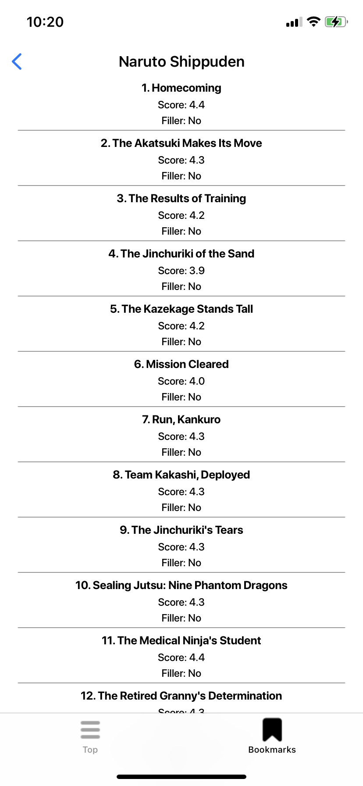

# ARating

<p align="center">
        
        
        
        
</p>

# Installation

### Carthage

1. You can install Carthage with [Homebrew](http://brew.sh/) using the following command:

```bash
$ brew update
$ brew install carthage
```

2. Run a command in a project directory:

```bash
carthage bootstrap --platform iOS --use-xcframeworks
```

3. Open `ARating.xcodeproj` in last Xcode version.

4. Build project `Cmd+R` or select `Product > Run` in menu.
